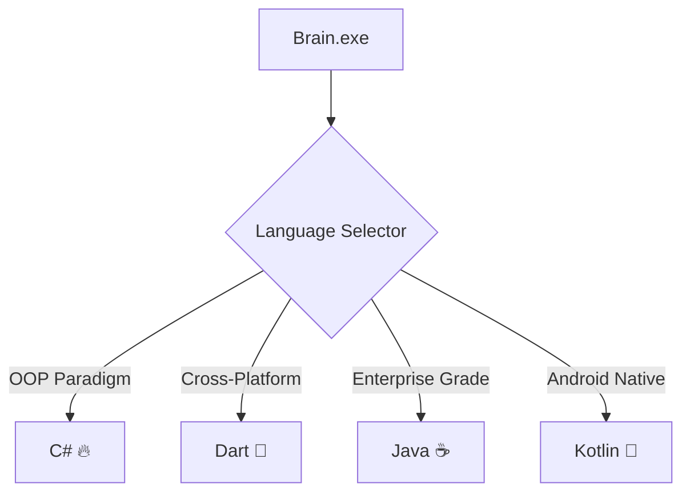

# 🖥️ System.out.println("Hello, World!"); 

```
┌─┐┬ ┬┌┬┐┬ ┬┌─┐┌┐┌┌┬┐┬┌─┐┌─┐┌┬┐┌─┐┌┬┐
├─┤│ │ │ ├─┤├┤ │││ │ ││ ├─┤ │ ├┤  ││
┴ ┴└─┘ ┴ ┴ ┴└─┘┘└┘ ┴ ┴└─┘┴ ┴ ┴ └─┘─┴┘
```

## 📡 Binary Introduction [01001000 01101001]

```bash
$ whoami
developer@guatemala:~$ echo "Caffeinated code architect from GT 🇬🇹"
$ ps aux | grep passion
passion    1337    99.9  42.0  /usr/bin/coding --mode=hardcore --fuel=coffee
$ uptime
 15:42:07 up ∞ days, 24:00, load average: 9.99, 8.88, 7.77
```

**Current Status:** `while(coffee.available()) { code(); }`

---

## ⚡ Technology Stack Analysis

### 🔧 Primary Compilers & Interpreters:



### 📊 Proficiency Matrix:
```
Language    │ Syntax Score │ Performance │ LOC Written │ Bug Ratio
════════════╪══════════════╪═════════════╪═════════════╪═══════════
C#          │ ████████████ │ ███████████ │ 500K+       │ 0.02%
Dart        │ ███████████░ │ ████████░░░ │ 200K+       │ 0.03%
Java        │ ████████████ │ ██████████░ │ 300K+       │ 0.01%
Kotlin      │ ██████████░░ │ ███████████ │ 150K+       │ 0.02%
```

### 🏗️ Framework Architecture:

```typescript
interface DeveloperFrameworks {
  backend: {
    dotnet: {
      versions: ["Framework 4.8", "Core 3.1", "5.0", "6.0", "7.0", "8.0"];
      expertise: "Senior";
      designPatterns: ["MVC", "Repository", "CQRS", "DDD"];
    };
    django: {
      version: "4.x";
      orm: "Active";
      restFramework: "Mastered";
    };
  };
  frontend: {
    flutter: {
      widgets: "Custom & Complex";
      stateManagement: ["Provider", "BLoC", "Riverpod"];
      platforms: ["iOS", "Android", "Web", "Desktop"];
    };
  };
}
```

---

## 🧠 Algorithmic Processes (Hobbies)

```python
class Developer:
    def __init__(self):
        self.hobbies = {
            'cinematography_analysis': {
                'preferred_genres': ['Sci-Fi', 'Thriller', 'Documentary'],
                'viewing_method': 'Critical analysis mode',
                'queue_size': float('inf')
            },
            'knowledge_acquisition': {
                'sources': ['Technical Books', 'Research Papers', 'Documentation'],
                'processing_speed': 'Optimized',
                'retention_rate': 0.95
            },
            'human_networking': {
                'protocol': 'TCP/IP (Talk, Code, Problem-solve/Inspire, Progress)',
                'port': 'Always open',
                'handshake': 'Successful'
            },
            'entrepreneurship': {
                'mindset': 'Disruptive innovation',
                'risk_tolerance': 'Calculated',
                'execution_model': 'Agile'
            }
        }
```

---

## 🚀 Current Process ID: LogisticsOS

```bash
╭─ project@logistics-system ‹main*› 
╰─$ git log --oneline | head -5
a1b2c3d (HEAD -> main) feat: Implement real-time tracking algorithms
e4f5g6h refactor: Optimize route calculation with Dijkstra's algorithm
h7i8j9k docs: Add comprehensive API documentation
k0l1m2n test: Achieve 97% code coverage on core modules
n3o4p5q ci/cd: Implement automated deployment pipeline
```

### 📋 System Requirements:
```json
{
  "project": "Logistics & Transportation Management System",
  "architecture": "Microservices",
  "database": "PostgreSQL + Redis",
  "message_queue": "RabbitMQ",
  "containerization": "Docker + Kubernetes",
  "monitoring": "Prometheus + Grafana",
  "estimated_completion": "Q2 2025",
  "current_sprint": "Route optimization algorithms"
}
```

### 🔄 Development Loop:
```bash
while (project.isActive()) {
    coffee.refill();
    requirements.analyze();
    architecture.design();
    code.write();
    tests.run();
    bugs.squash();
    performance.optimize();
    documentation.update();
    sleep(4); // hours, because coffee
}
```

---

## 📈 Performance Metrics

```
╔════════════════════════════════════════════════════════════╗
║                    SYSTEM DIAGNOSTICS                     ║
╠════════════════════════════════════════════════════════════╣
║ CPU Usage (Coding):        ████████████████████ 95%       ║
║ Memory (Knowledge):        ████████████████░░░░ 80%       ║
║ Disk Space (Experience):   █████████████████░░░ 85%       ║
║ Network (Collaboration):   ████████████████████ 100%      ║
║ Coffee Buffer:             ████████████░░░░░░░░ 60%       ║
╚════════════════════════════════════════════════════════════╝
```

### 🎯 Code Quality Gates:
- **Cyclomatic Complexity:** < 10
- **Code Coverage:** > 90%
- **SOLID Principles:** Implemented
- **Clean Code:** Robert C. Martin approved

---

## 🌐 Network Configuration

```yaml
developer:
  location: 
    country: "Guatemala"
    timezone: "GMT-6"
    altitude: "1500m (Perfect coffee growing altitude)"
  
  network_interfaces:
    coffee_intake: "192.168.1.☕/24"
    collaboration: "0.0.0.0/0 (Open to all)"
    learning: "255.255.255.255 (Broadcast mode)"
  
  services_running:
    - problem_solving: "Port 80 (Always available)"
    - mentorship: "Port 443 (Secure and reliable)"
    - innovation: "Port 8080 (Development mode)"
```

### 📡 API Endpoints:
```bash
GET    /api/v1/collaboration     # Available for partnerships
POST   /api/v1/help-request      # Submit your coding problems
PUT    /api/v1/knowledge-share   # Exchange technical insights
DELETE /api/v1/bugs              # I'll help you eliminate them
```

---

## 🔐 Security & Compliance

```
╭──────────────────────────────────────────╮
│ SECURITY CLEARANCE: SENIOR DEVELOPER    │
├──────────────────────────────────────────┤
│ • Clean Code Practices ✓                │
│ • Data Protection Standards ✓           │
│ • Coffee Security Protocol ✓            │
│ • Bug Bounty Hunter License ✓           │
╰──────────────────────────────────────────╯
```

---

## 🏆 Achievement Unlocked

```
┌─[ DEVELOPER ACHIEVEMENTS ]─────────────────────────────────┐
│                                                            │
│  🥇 Coffee-Driven Development         [████████████] 100%  │
│  🎯 Problem Solving Specialist        [████████████] 100%  │
│  🌟 Cross-Platform Architect          [███████████░]  95%  │
│  🚀 System Performance Optimizer      [██████████░░]  90%  │
│  🧪 Unit Testing Evangelist           [████████████] 100%  │
│  📚 Continuous Learning Advocate      [████████████] 100%  │
│                                                            │
└────────────────────────────────────────────────────────────┘
```

---

## 📞 Connection Protocol

```bash
# Initialize connection
$ ssh mbrdeleonrodriguez@gmail.com
$ telnet collaboration.port 80

# Or use modern protocols
$ curl -X GET "https://api.developer.gt/contact" \
  -H "Accept: application/json" \
  -H "Coffee-Level: high"

Response: {
  "status": "online",
  "availability": "24/7 (coffee permitting)",
  "specialties": ["Backend", "Mobile", "System Architecture", ".NET"],
  "collaboration_mode": "enabled"
}
```

---

<div align="center">

```
╔══════════════════════════════════════════════════════════════╗
║                                                              ║
║    "Any fool can write code that a computer can understand.  ║
║     Good programmers write code that humans can understand." ║
║                                        - Martin Fowler      ║
║                                                              ║
╚══════════════════════════════════════════════════════════════╝
```

### 🔄 Repository.fork() || Repository.star() || Repository.contribute()

**Last commit:** `git commit -m "Living the code, one coffee at a time ☕"`

</div>

---

*Compiled with 💻, powered by ☕, optimized for 🌍 - Made in Guatemala* 🇬🇹
